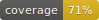

# GOEN Website (Front & Back)

| **Backend Testing**                                             | **Frontend Testing** |
| --------------------------------------------------------------- | -------------------- |
|  | None yet             |

Any configuration must be done within the respective folder (backend or frontend) unless otherwhise specified.

## Backend

### Initial config

1. Install backend dependencies

   ```bash
   composer install
   ```

2. Create **.env** file by copying **.env.example**
3. Create an **APP KEY** by executing the following command:

   ```bash
   php artisan key:generate
   ```

4. Run migrations

   ```bash
   php artisan migrate
   ```

5. Generate passport keys via

   ```bash
   php artisan passport:install
   ```

6. Start up the local development server

   ```bash
   php artisan serve
   ```

7. **Optional**: You can generate a Postman collection for the API by running the following command:

   ```bash
   php artisan apidoc:generate
   ```

   The **collection.json** file will be generated in **./backend/public/docs/**.

## Frontend

### Initial config

1. Install frontend dependencies using **yarn** or **npm**
2. Create **.env** file by copying **.env.example**
3. Start up the development server

   ```bash
   yarn start
   ```

   ```bash
   npm run start
   ```

## Deployment

Deployment is done automatically, both for backend and frontend, by pushing master.

Backend is deployed to a Heroku App.

Frontkend is deployed to Netlify.

### Backend initial config

1. Create a Heroku App if one does not exist already
2. Install the following addons:

   - MySQl Clear DB
   - Sendgrid

3. Set Heroku environment variables based on the local **.env**
4. Create and set the following environment variables in the **Bitbucket** repo.
   - \$HEROKU_API_KEY
   - \$HEROKU_APP_NAME
5. Run migrations on server
6. Generate passport keys via

   ```bash
   php artisan passport:install
   ```

### Frontend initial config

1. Create a Netlify site and link it to the master branch of the repository.
2. The **netlify.toml** file will be used to build the site.

## Problems

### 1.- **oauth.private.key** does not exist or is not readable (Heroku)

Run the following commands:

```bash
heroku ps:exec -a deployed_app_name
```

```bash
php artisan passport:keys
```
